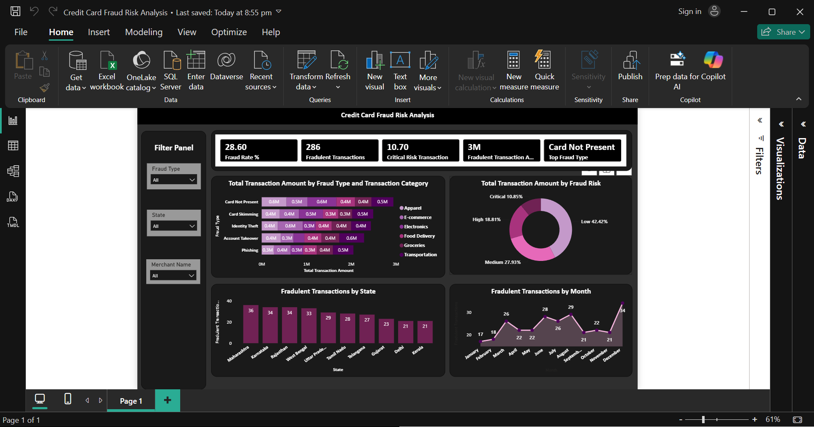

# 💳 Credit Card Fraud Risk Analysis Dashboard

An interactive **Power BI dashboard** designed to analyze credit card transaction data, monitor fraud-related KPIs, and identify high-risk patterns through intuitive visualizations. This project demonstrates the application of business intelligence techniques to support fraud detection and risk monitoring.

----

# Dashboard Preview



----

# Project Overview

Credit card fraud is a significant challenge for financial institutions, requiring continuous monitoring of transaction behavior to minimize financial losses and protect customers.

This dashboard transforms raw transaction data into actionable insights by tracking fraud metrics, analyzing fraud trends, and identifying high-risk transaction patterns across different fraud categories, locations, and transaction types.

The project demonstrates how Power BI can be used to support **data-driven decision-making** in fraud analytics and operational risk management.

----

# Business Problem

Financial organizations process thousands of transactions every day, making manual fraud detection inefficient and time-consuming.

The objective of this dashboard is to:

- Monitor fraudulent transactions in real time
- Track fraud-related KPIs
- Analyze transaction amounts by fraud risk
- Identify high-risk fraud categories
- Detect geographical fraud patterns
- Support faster business decisions through interactive reporting

---

# Dataset

The dashboard is built using a simulated credit card transaction dataset containing information such as:

- Transaction ID
- Customer Name
- Merchant Name
- Transaction Amount
- Transaction Date
- Fraud Type
- Fraud Risk
- Fraud Score
- Transaction Category
- Card Type
- State
- Bank
- Merchant Location
- Fraud Status

---

# Dashboard Features

### KPI Cards

- Fraud Rate (%)
- Fraudulent Transactions
- Critical Risk Transactions
- Fraudulent Transaction Amount
- Top Fraud Type

### Interactive Filters

- Fraud Type
- State
- Merchant Name

### Visualizations

- Total Transaction Amount by Fraud Type and Transaction Category
- Total Transaction Amount by Fraud Risk
- Fraudulent Transactions by State
- Fraudulent Transactions by Month

---

# Key Business Insights

The dashboard enables users to:

- Monitor overall fraud performance using key KPIs.
- Compare transaction amounts across different fraud categories.
- Understand the distribution of Low, Medium, High, and Critical risk transactions.
- Identify states with the highest number of fraudulent transactions.
- Analyze monthly fraud trends to detect seasonal or recurring fraud patterns.
- Determine the most common fraud type affecting customers.

---

# Business Value

This dashboard helps organizations:

- Improve fraud monitoring
- Support risk-based decision making
- Detect fraud patterns quickly
- Prioritize high-risk transactions
- Reduce manual reporting efforts
- Improve operational visibility

---

# Tools & Technologies

- Power BI
- Power Query
- DAX
- Microsoft Excel / CSV
- Data Modeling

---

# Skills Demonstrated

### Data Analytics

- Data Cleaning
- Data Transformation
- Data Validation
- Data Visualization
- KPI Development

### Business Analytics

- Business Intelligence Reporting
- Trend Analysis
- Risk Monitoring
- Interactive Dashboard Design
- Performance Reporting
- Decision Support Analytics

### Risk Analytics

- Fraud Risk Analysis
- Fraud Pattern Identification
- Risk Classification
- Fraud Trend Monitoring
- Risk KPI Tracking

---

# Repository Structure

```
Credit-Card-Fraud-Risk-Analysis/
│
├── Dataset/
│   └── Credit Card Fraud Risk Analysis.csv
│
├── Images/
│   └── dashboard.png
│
├── Credit Card Fraud Risk Analysis.pbix
│
└── README.md
```

---

# How to Use

1. Clone the repository.
2. Open the `.pbix` file using **Microsoft Power BI Desktop**.
3. Refresh the dataset if required.
4. Explore the dashboard using the available filters and slicers.

---

# Future Enhancements

- Publish the dashboard to Power BI Service.
- Implement drill-through pages for detailed fraud investigation.
- Integrate live transaction data.
- Add predictive fraud risk scoring using Machine Learning.
- Automate data refresh for real-time reporting.

---

# Author

**Aditya Anand**

Aspiring Data Analyst | Business Analyst | Risk Analyst

If you found this project interesting, feel free to connect with me on LinkedIn or explore my other analytics projects.
